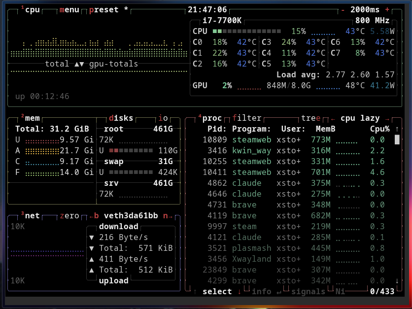

# btop Widget for KDE Plasma 6

A KDE Plasma 6 widget that embeds the [btop](https://github.com/aristocratos/btop) resource monitor directly on your desktop.

## Preview



## Requirements

- KDE Plasma 6
- `btop` installed (`/usr/bin/btop`)
- `qmlterm-widget` (provides `QMLTermWidget`)

On Arch Linux:
```bash
sudo pacman -S btop
yay -S qmlterm-widget
```

## Installation

### Manual

```bash
git clone https://github.com/Xstoff0711/btop-widget.git
cd btop-widget
bash install.sh
```

Then right-click your desktop → **Add Widgets** → search for **btop Widget**.

### AUR

Coming soon.

## Uninstall

```bash
kpackagetool6 --type Plasma/Applet --remove com.xstoff.btopwidget
```

## License

[GPL-2.0-or-later](https://www.gnu.org/licenses/gpl-2.0.html)
